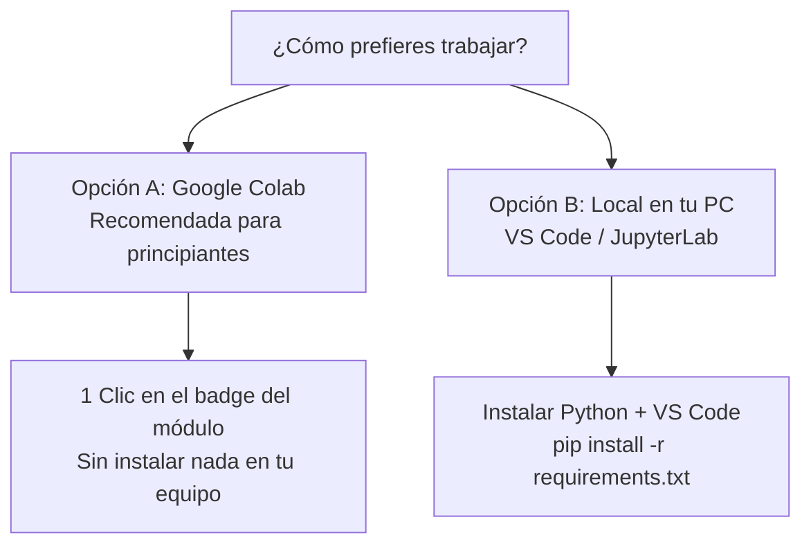
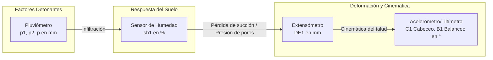

# 🧭 Guía de Inicio Rápido y Supervivencia en Python para Geotecnia

Bienvenido/a al laboratorio computacional del curso de **Instrumentación Geotécnica** (Universidad EAFIT). 

Esta guía está diseñada especialmente para estudiantes e ingenieros de geotecnia, vías y geología que **nunca han programado en Python** o que están dando sus primeros pasos.

---

## 1. ¿Cómo ejecutar las prácticas? (Dos opciones)

Tienes dos alternativas para realizar las prácticas. **Si nunca has programado, te recomendamos la Opción A (Google Colab).**



---

### Opción A: Google Colab (100% en la nube, sin instalaciones) ⭐ *Recomendada*

Google Colab es un entorno gratuito que ejecuta Python directamente en los servidores de Google a través de tu navegador web.

1. Ve al archivo [README.md](file:///Users/federicogomez/Library/CloudStorage/GoogleDrive-federicogomezcar@gmail.com/My%20Drive/Docencia/instrumentacion-geotecnica/README.md) y haz clic en el botón **"Abrir en Colab"** del módulo que deseas estudiar.
2. Al abrirse el notebook, haz clic en **`Archivo` > `Guardar una copia en Drive`**. Esto creará una copia en tu cuenta personal de Google para que tus cambios y notas queden guardados.
3. Ejecuta la **primera celda de configuración** en el notebook. Esta celda descargará automáticamente los datos de los sensores (`pluviometro.csv`, `humedad.csv`, etc.) a tu sesión de Colab.
4. ¡Listo! Ya puedes avanzar celda por celda ejecutando y modificando el código.

---

### Opción B: Entorno Local (En tu computador con VS Code o Jupyter)

Si prefieres tener todo instalado localmente en tu equipo:

1. **Instalar Python:** Asegúrate de tener instalado Python 3.9 o superior (descárgalo desde [python.org](https://www.python.org/) o mediante Anaconda).
2. **Clonar o descargar el repositorio:**
   ```bash
   git clone https://github.com/federicogmz/instrumentacion-geotecnica.git
   cd instrumentacion-geotecnica
   ```
   *(O descarga el archivo ZIP desde GitHub y descomprímelo en una carpeta de tu preferencia)*.
3. **Instalar las librerías necesarias:** Abre tu terminal o consola de comandos en la carpeta del curso y ejecuta:
   ```bash
   pip install -r requirements.txt
   ```
4. **Abrir el entorno:**
   - Si usas **VS Code**: Abre la carpeta `instrumentacion-geotecnica` e instala la extensión "Jupyter". Abre cualquier archivo `.ipynb` de la carpeta `notebooks/`.
   - Si usas **JupyterLab / Notebook**: Ejecuta en la terminal:
     ```bash
     jupyter lab
     ```

---

## 2. Guía de Supervivencia: Conceptos Clave de Python para Geotécnicos

Un **Jupyter Notebook (`.ipynb`)** es un documento interactivo dividido en **celdas**:
- **Celdas de texto (Markdown):** Explicaciones teóricas, fórmulas e imágenes.
- **Celdas de código:** Bloques de código Python ejecutables.

### Comandos esenciales del teclado:
- **`Shift + Enter`**: Ejecuta la celda actual y pasa a la siguiente.
- **`Ctrl + Enter`**: Ejecuta la celda actual sin moverse.
- **`Esc + B`**: Inserta una nueva celda debajo (*Below*).
- **`Esc + D + D`**: Elimina la celda seleccionada.

---

### Analogías para entender Python sin ser programador

| Concepto en Python | Analogía Geotécnica / Ingeniería | Ejemplo de Código |
| :--- | :--- | :--- |
| **Variable** | Una etiqueta en una caja de muestras o un valor de laboratorio. | `cohesion = 25.4  # kPa`<br/>`nivel_freatico = 3.2  # m` |
| **Lista** | Una columna de tu libreta de campo con varias lecturas de un sensor. | `lecturas_lluvia = [0.0, 5.2, 12.8, 0.0]` |
| **Función (`def`)** | Una fórmula o procedimiento estándar de laboratorio (ej. peso unitario). | `def peso_unitario(peso, volumen):`<br/>`    return peso / volumen` |
| **DataFrame (Pandas)** | Una tabla de Excel inteligente, optimizada para millones de filas. | `df = pd.read_csv('datos.csv')` |
| **Series** | Una única columna de esa tabla de Excel (ej. solo precipitación). | `df['p']` |
| **Índice (`index`)** | La columna guía; en monitoreo, casi siempre es la **fecha y hora** (`DatetimeIndex`). | `df.index = pd.to_datetime(...)` |
| **`NaN`** | *Not a Number*: Dato faltante (sensor apagado, batería agotada o falla de telemetría). | `df.isna().sum()` |

---

## 3. Diccionario de Errores Comunes (¿Qué hago si algo sale mal?)

Cuando Python encuentra un problema, muestra un mensaje en rojo. **No te asustes**, te está diciendo exactamente qué pasó y en qué línea:

1. **`NameError: name 'pd' is not defined` (o `'plt'`, `'df'`)**
   - *Causa:* Intentaste usar una librería o variable antes de haberla cargado.
   - *Solución:* Asegúrate de haber ejecutado primero las celdas superiores del notebook donde se hacen los `import` (`import pandas as pd`). En un notebook, las celdas deben ejecutarse en orden descendente.

2. **`FileNotFoundError: [Errno 2] No such file or directory: '../data/...'`**
   - *Causa:* Python no encuentra el archivo CSV en la ruta indicada (ocurre comúnmente al abrir en Google Colab sin descargar los datos).
   - *Solución:* Ejecuta la celda inicial de configuración de Colab al principio del notebook.

3. **`KeyError: 'precipitacion'`**
   - *Causa:* La columna que pediste no existe con ese nombre exacto. Python distingue entre mayúsculas y minúsculas (`'P'` es diferente de `'p'`).
   - *Solución:* Revisa los nombres exactos de las columnas con `print(df.columns)`.

4. **`SyntaxError: unexpected EOF while parsing` o `invalid syntax`**
   - *Causa:* Olvidaste cerrar un paréntesis `)`, una comilla `'` o dos puntos `:`.
   - *Solución:* Revisa los signos de puntuación en la línea señalada.

---

## 4. El Caso de Estudio: Movimiento en Masa Ancón Norte

Todos los datos utilizados en las prácticas provienen de un caso real monitoreado por el **SIATA** en Copacabana (Antioquia, Colombia):

- **Tipo de evento:** Movimiento en masa complejo con superficies de falla identificadas a **11 m, 16 m y 22 m** de profundidad, abarcando un área de aproximadamente 7 hectáreas.
- **Elementos en riesgo:** Autopista Medellín-Girardota, barrio Ancón Norte, redes de servicios públicos y el Poliducto Medellín-Cisneros.

### Resumen de Sensores en el Repositorio



| Sensor | Columna(s) | Magnitud y Unidad | Interpretación Geotécnica |
| :--- | :--- | :--- | :--- |
| **Pluviómetro** | `p1`, `p2`, `p` | Precipitación acumulada ($\text{mm}$) | Factor detonante. `p1` y `p2` provienen de balancines gemelos; tomar el máximo previene lecturas erróneas por atascos de hojas. |
| **Sensor de Humedad** | `sh1` | Contenido volumétrico de agua ($\%$) | Refleja el avance del frente de infiltración y la saturación del perfil del suelo. |
| **Extensómetro** | `DE1` | Desplazamiento relativo ($\text{mm}$) | Monitorea la apertura progresiva de grietas de tracción y el avance superficial del movimiento. |
| **Acelerómetro / Tilt** | `C1`, `B1` | Ángulos de inclinación / tilt ($\text{grados}$) | Mide el giro o pérdida de verticalidad: `C1` (cabeceo o *pitch*) y `B1` (balanceo o *roll*). Cambios bruscos señalan rotación del bloque de falla. |
| **Temperatura** | `Tem_1` | Temperatura ambiente / sensor ($^\circ\text{C}$) | Usada para compensar térmicamente los sensores y descartar fluctuaciones estacionales. |

---

## 5. Recomendaciones Pedagógicas para el Estudio

1. **No memorices código:** La programación en geotecnia se aprende experimentando. Cambia los números, prueba otros sensores y observa qué cambia en las gráficas.
2. **Conecta cada gráfica con la física del talud:** Cada vez que veas un pico o una anomalía, pregúntate: *¿Llovió ese día? ¿Aumentó la humedad? ¿Se abrió la grieta?*
3. **Consulta el archivo [Caso Estudio.pdf](file:///Users/federicogomez/Library/CloudStorage/GoogleDrive-federicogomezcar@gmail.com/My%20Drive/Docencia/instrumentacion-geotecnica/data/Caso%20Estudio.pdf):** Allí encontrarás fotografías de campo, mapas de ubicación y detalles del monitoreo in situ.
