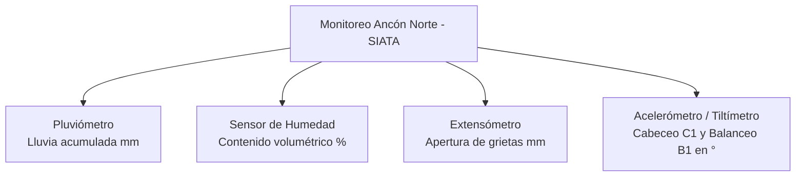

# Curso de Instrumentación Geotécnica | Universidad EAFIT
### 💻 Laboratorio Práctico y Análisis Computacional de Sensores

[](https://creativecommons.org/licenses/by-nc-sa/4.0/)


[](https://federicogmz.github.io/instrumentacion-geotecnica/)
[](GUIA_INICIO_RAPIDO.md)

---

### Docentes
- **M.Eng. Federico Gómez** — [fjgomezc@eafit.edu.co](mailto:fjgomezc@eafit.edu.co)
- **M.Eng. Juliana Álvarez** — [jalvarezz@eafit.edu.co](mailto:jalvarezz@eafit.edu.co)

---

> [!TIP]
> 🌐 **¡Plataforma Web Interactiva en Vivo (GitHub Pages)!**  
> Puedes estudiar la teoría y programar en Python directamente en tu navegador sin instalar nada:  
> 👉 **[Entrar a la Plataforma Web Interactiva](https://federicogmz.github.io/instrumentacion-geotecnica/)**  
> *(Incluye explicaciones interactivas, quizzes con retroalimentación inmediata, editor de Python con ejecución en WebAssembly y laboratorio libre)*.

---

## 🎯 Sobre este Repositorio (Componente Práctico)

El curso de **Instrumentación Geotécnica** de la Universidad EAFIT se estructura en dos componentes complementarios:

1. **Etapa Teórica (Cátedra):** Fundamentos geomecánicos, principios físicos de transducción y sensores, factores detonantes/condicionantes de inestabilidad y diseño de redes de monitoreo.
2. **Etapa Práctica (Este Repositorio):** Laboratorios computacionales aplicados. Aquí aprenderás a procesar, depurar, integrar y analizar datos reales de instrumentación de campo utilizando Python.

> [!IMPORTANT]
> **¿No tienes conocimientos previos de programación?**  
> ¡No te preocupes! El material práctico está diseñado desde cero, con explicaciones paso a paso pensadas para ingenieros civiles, geotecnistas y geólogos. Consulta la [**Guía de Inicio Rápido y Supervivencia en Python**](GUIA_INICIO_RAPIDO.md) para familiarizarte con las herramientas básicas.

---

## 🚀 Acceso Directo a los Módulos Prácticos (Google Colab)

Puedes ejecutar los cuadernos de trabajo directamente en tu navegador sin instalar nada en tu computador haciendo clic en las insignias:

| Módulo | Contenido Principal | Ejecutar en la Nube |
| :--- | :--- | :---: |
| **Módulo 1**<br/>`Introducción a Python para Geotecnia` | Variables, estructuras de datos, condicionales, funciones y primeros pasos con Pandas usando lecturas reales de lluvia y humedad. | [](https://colab.research.google.com/github/federicogmz/instrumentacion-geotecnica/blob/main/notebooks/Modulo_1_Introduccion_Python.ipynb) |
| **Módulo 2**<br/>`Visualización de Datos de Sensores` | Creación de series temporales multivariables con Matplotlib, remuestreo temporal diario/semanal, boxplots para dispersión y gráficos con doble eje. | [](https://colab.research.google.com/github/federicogmz/instrumentacion-geotecnica/blob/main/notebooks/Modulo_2_Visualizacion_Datos.ipynb) |
| **Módulo 3**<br/>`Análisis Temporal y Detección de Anomalías` | Diagnóstico e interpolación de datos faltantes, detección de outliers (Z-Score y Tukey), cálculo de acumulados móviles, tasas de cambio y correlaciones rezagadas. | [](https://colab.research.google.com/github/federicogmz/instrumentacion-geotecnica/blob/main/notebooks/Modulo_3_Analisis_Datos.ipynb) |

---

## 🏔️ Caso de Estudio: Movimiento en Masa Ancón Norte (Copacabana, Antioquia)

Todas las prácticas del curso se desarrollan con base en un caso de estudio real monitoreado por el **Sistema de Alerta Temprana de Medellín y el Valle de Aburrá (SIATA)**:

- **Ubicación:** Vía Medellín-Girardota km 18 (Copacabana).
- **Morfodinámica:** Movimiento en masa complejo con superficies de falla identificadas a profundidades de **11 m, 16 m y 22 m**, afectando un área de aproximadamente 7 hectáreas.
- **Elementos expuestos:** Viviendas del barrio Ancón Norte, calzada principal de acceso vial, redes de acueducto y energía, y el Poliducto Medellín-Cisneros.
- **Documento técnico detallado:** Consulta el reporte completo en [data/Caso Estudio.pdf](data/Caso%20Estudio.pdf).

### Sensores y Variables Monitoreadas



| Variable / Columna | Sensor | Unidad | Rol en la Evaluación Geotécnica |
| :--- | :--- | :---: | :--- |
| `p1`, `p2`, `p` | Pluviómetro de balancín | $\text{mm}$ | Detonante principal. Se registran canales duplicados para garantizar la integridad del dato ante eventuales obstrucciones. |
| `sh1` | Sonda de humedad en suelo | $\%$ | Monitorea la saturación del perfil del terreno y el avance del frente húmedo tras precipitaciones. |
| `DE1` | Extensómetro de hilo/varilla | $\text{mm}$ | Cuantifica la cinemática superficial y apertura progresiva de grietas de tracción en la corona del deslizamiento. |
| `C1`, `B1` | Acelerómetro / Tiltímetro biaxial | $\text{grados}$ | Registra la inclinación o pérdida de verticalidad del terreno: `C1` (Cabeceo / Pitch) y `B1` (Balanceo / Roll). |
| `Tem_1` | Sensor de temperatura | $^\circ\text{C}$ | Utilizado para correcciones por dilatación térmica instrumental y análisis ambiental. |

---

## 🛠️ Instalación y Uso en Entorno Local

Si prefieres trabajar de forma local en tu propia máquina (con VS Code o JupyterLab):

1. **Clona el repositorio:**
   ```bash
   git clone https://github.com/federicogmz/instrumentacion-geotecnica.git
   cd instrumentacion-geotecnica
   ```

2. **Crea y activa un entorno virtual (recomendado):**
   ```bash
   # En Windows
   python -m venv venv
   .\venv\Scripts\activate

   # En macOS / Linux
   python3 -m venv venv
   source venv/bin/activate
   ```

3. **Instala las dependencias:**
   ```bash
   pip install -r requirements.txt
   ```

4. **Inicia JupyterLab:**
   ```bash
   jupyter lab
   ```

---

## 📁 Estructura del Repositorio

```text
instrumentacion-geotecnica/
├── index.html                  # Plataforma web interactiva para GitHub Pages
├── GUIA_INICIO_RAPIDO.md       # Guía paso a paso para estudiantes principiantes
├── README.md                   # Presentación del componente práctico
├── requirements.txt            # Librerías de Python requeridas
├── LICENSE                     # Licencia de uso (CC BY-NC-SA 4.0)
│
├── css/                        # Estilos y diseño responsivo del laboratorio web
│   └── styles.css
│
├── js/                         # Lógica interactiva y motor de cómputo en el navegador
│   ├── app.js                  # Orquestación de interfaz, lecciones y progreso
│   ├── course-data.js          # Contenidos teóricos, ejercicios, pistas y soluciones
│   └── pyodide-runner.js       # Motor Python WebAssembly (NumPy, Pandas, Matplotlib)
│
├── data/                       # Datos reales de sensores y documentación de campo
│   ├── Caso Estudio.pdf        # Informe del movimiento en masa de Ancón Norte (SIATA)
│   ├── TDR.png                 # Esquema y registros de reflectometría en el dominio del tiempo
│   ├── acelerometro.csv        # Series de aceleración / inclinación (C1, B1, Tem_1)
│   ├── df_ancon.csv            # Serie diaria consolidada y curada para análisis
│   ├── extensometro.csv        # Serie de alta frecuencia de deformación superficial (DE1)
│   ├── humedad.csv             # Serie temporal de contenido de agua en el suelo (sh1)
│   └── pluviometro.csv         # Serie temporal de precipitación (p1, p2)
│
└── notebooks/                  # Cuadernos interactivos de laboratorio (Jupyter / Colab)
    ├── Modulo_1_Introduccion_Python.ipynb    # Fundamentos de Python y Pandas aplicados
    ├── Modulo_2_Visualizacion_Datos.ipynb    # Visualización con Matplotlib y remuestreo
    └── Modulo_3_Analisis_Datos.ipynb         # Feature engineering, anomalías y correlaciones
```
```

---

## 💡 Consejos para Aprovechar el Curso

- **Experimenta:** Cambia los rangos de fechas, prueba diferentes ventanas de remuestreo (semanal, mensual) y observa el impacto en las señales.
- **Relaciona los datos con el terreno:** Los picos y saltos en las curvas no son simples números; representan lluvia intensa, saturación del suelo o reactivaciones cinemáticas del deslizamiento.
- **Apóyate en los docentes:** Ante cualquier inquietud técnica o conceptual, contáctanos a través de los correos institucionales.

¡Muchos éxitos en tu aprendizaje de la instrumentación geotécnica computacional!